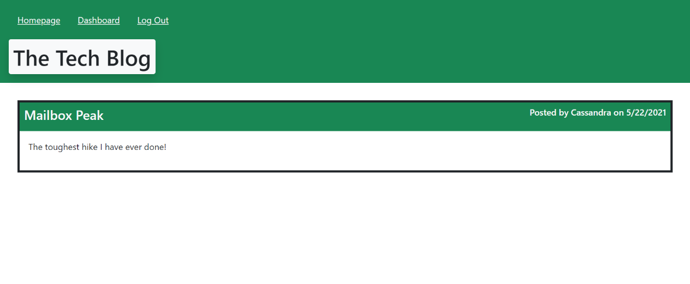
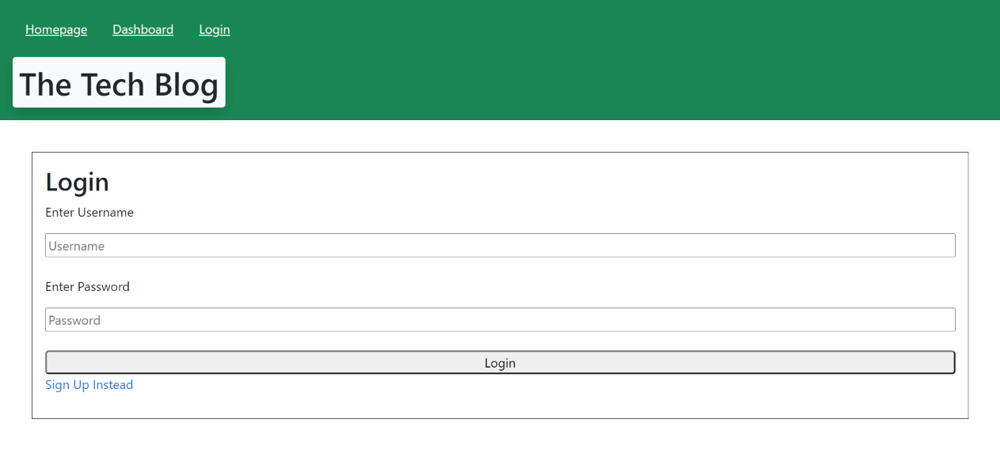
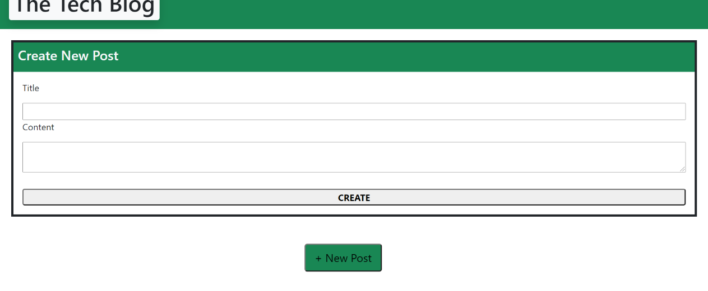
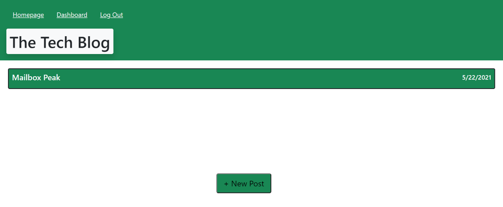

# MVC-Tech_Blog

## Description:
An app to publish blog posts, my thoughts and feelings.

## Repository
[Application Repository URL](https://github.com/cmcunningham27/MVC-Tech_Blog)

## Table of contents
* [Project's-aim](#project's-aim)
* [How-to-use](#how-to-use)
* [Link-to-deployed-application](#link-to-deployed-application)
* [Technologies](#technologies)
* [Contributors](#contributors)
* [Challenges](#Challenges)
* [License](#license)
* [Possible-future-add-ons](#possible-future-add-ons)

## Project's aim
My aim for this app is to allow users the opportunity to see other's blogs and comment on them, and create, update, or delete their own blogs for others to see and comment on.

## How to use
Upon navigating to the site new users will be presented with a homepage where they will see blogs others and themselves have posted. They have the option to login if they wish to comment on those blogs. Once logged in they are immediately brought to their dashboard. When they click the homepage link they are provided the past blogs and are now able to click on their titles and leave a comment. They can return to their dashboard and are shown their past blog post (if they have created some already) and/or they see a button at the bottom of the screen giving them to option to create a new Blog post. When they click on the New Post button they are given a form to enter the title and contents for their blog. Once they click the Create button they return to their dashboard with an up-to-date list of their Blog posts. If they click on the title of one of their past Blog posts they return to the previous form with the specific Blog's title and contents, they can change one or both items and click the Update button to save the changes. They return to their dashboard with the updated Blog post and any others they have created. If they choose to click the Delete button instead, the blog will be removed from their posts and upon returning to their dashboard, they will no longer see that Blog post. At the top there is the option to log out by clicking the LogOut link in the nav bar. They are then returned to the homepage.

## Link to deployed application:
[Tech Blog](https://safe-river-08906.herokuapp.com)

## Technologies
Project is created with:

* CSS 
* Bootstrap
* Vanilla Javascript
* Node.js
* Express.js
* Handlebars.js 
* Sequelize.js
* Express-Session.js
* Bycrypt.js
* MySQL2

## Contributors:
* [Cassandra-Cunningham](https://github.com/cmcunningham27)

## Challenges
* I tried to have the single Blog and Comment functionality on the hompage, but realized it would make more sense to create the single Blog's own page on /blog. This made the process a bit easier to work with.
* Having the comment render after the user created a comment for a specific blog proved to be difficult. The route was being called and working properly. However, the res.render was not working. I did get some help to remedy this challenge. I was notified about the use of {{#if @last}}.
* I am learning how important including module.exports = router; at the bottom of the api routes. I have forgotten it a couple times and finally learned my lesson!
* I ran into a complication when it came to the right location for the eventlisteners that called the update and delete functions. If I had them in their own if statement at the bottom of the dashboard script file then the id was coming up undefined. I had to put them at the bottom of the toggle function in order for the id to include a value.

## License
This project is licensed under the MIT license.

## Possible future add ons
* Could create functionality where the user could look up a specific user name to see only their blog posts.

## Questions
[E-mail](mailto:sttepstutoring@yahoo.com)

E-mailing me is the best option